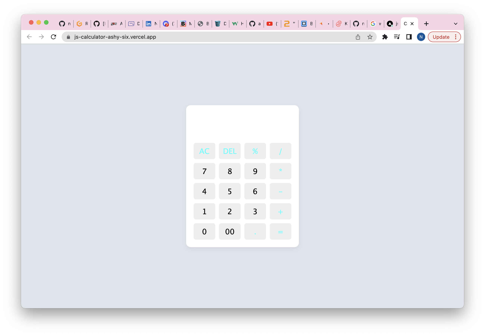
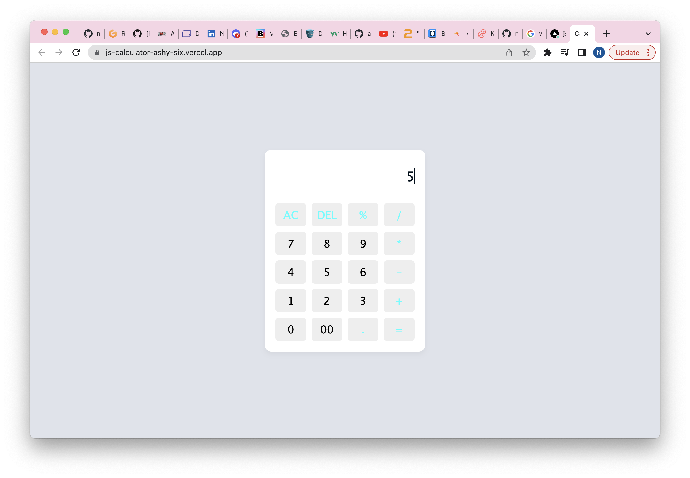
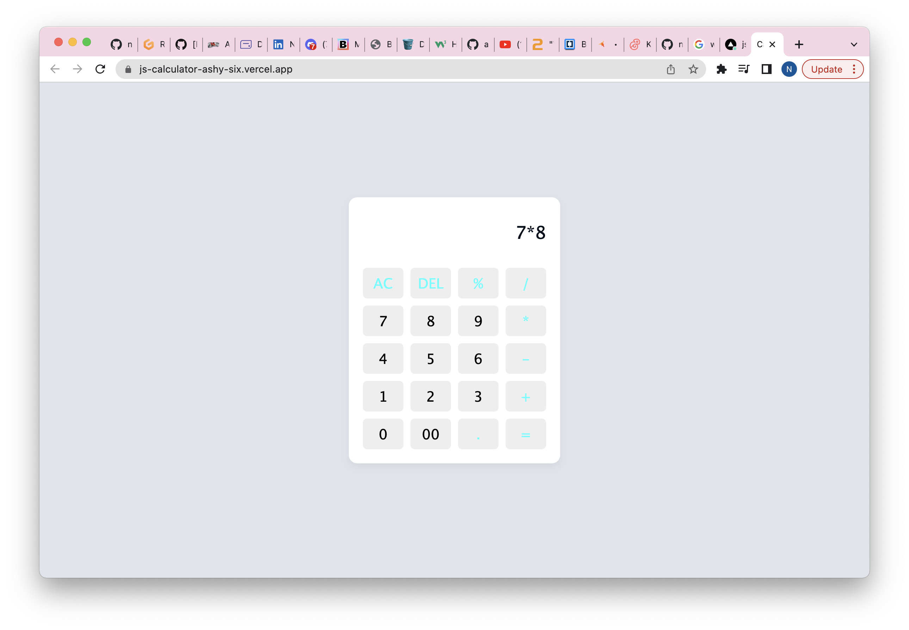
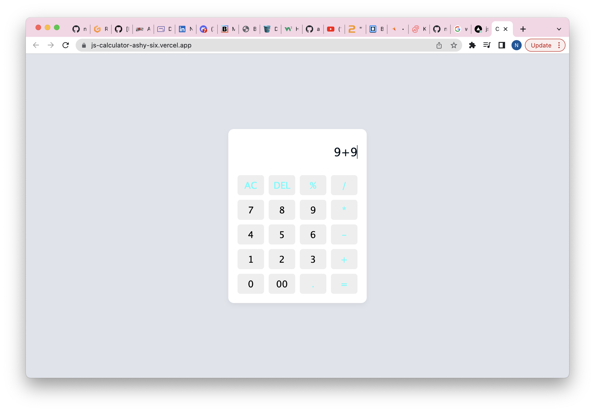
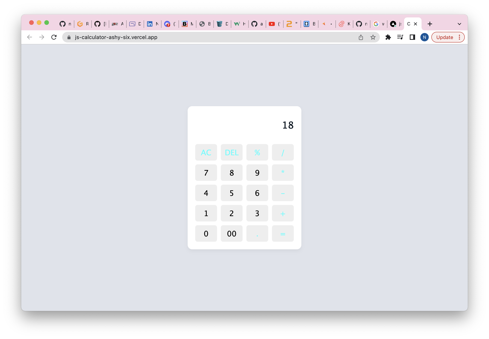

# JS-Calculator
HTML CSS and JS Calculator

Live website - https://js-calculator-ashy-six.vercel.app/

Using HTML5/CSS3/Javascript to create a simple calculator which can + - * / and also deleting items

Pictures below where I + & *

Thanks
